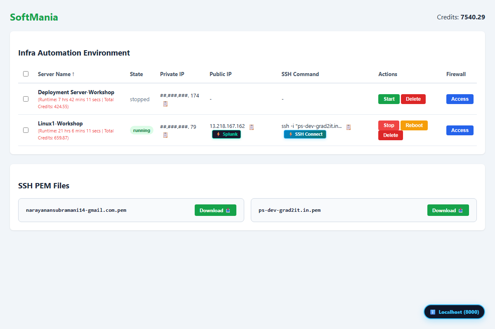
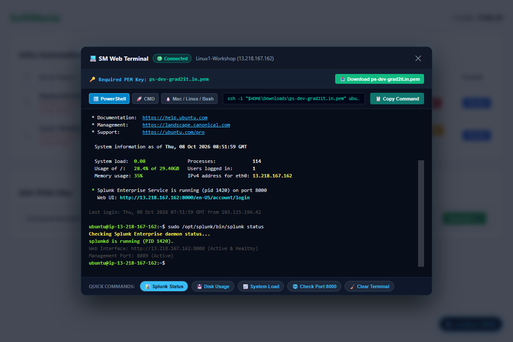
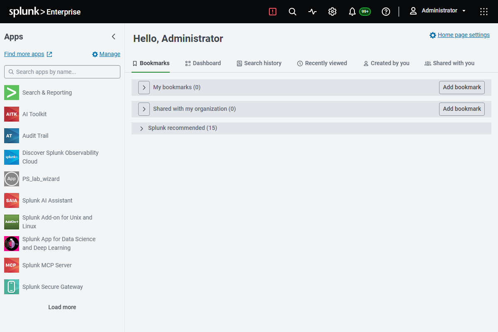
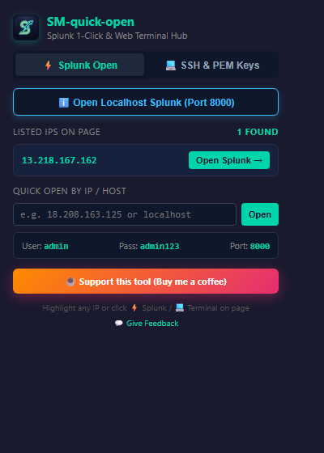
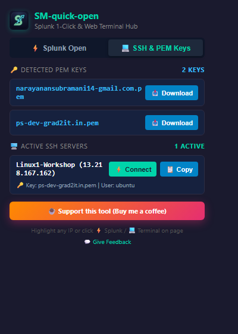

<div align="center">

# ⚡ SM-quick-open
### 1-Click Splunk Auto-Login & In-Browser Web SSH Terminal with Automatic PEM Key Matching

[](https://opensource.org/licenses/MIT)
[](https://developer.chrome.com/docs/extensions/mv3/intro/)
[](tests/)
[](#-browser-support)
[](CONTRIBUTING.md)
[](https://buymeacoffee.com/narayanansw)

**A lightning-fast, zero-dependency browser extension built for DevOps engineers, Cloud Architects, and Lab Practitioners.**  
Auto-detects public IPs, signs into Splunk Enterprise instances with 1 click, matches EC2 PEM keys from web dashboards, and runs interactive in-browser SSH terminal sessions powered by xterm.js.

[Key Features](#-key-features) • [Screenshots](#-visual-showcase) • [Installation](#-installation-guide) • [Architecture](#-architecture) • [Testing](#-automated-e2e-testing) • [Contributing](#-contributing)

---

</div>

## 📌 Why SM-quick-open?

Managing cloud training portals, AWS EC2 lab instances, and distributed Splunk clusters requires repetitive copy-pasting of IP addresses, switching between browser tabs and native terminal windows, and hunting down matching `.pem` private keys.

**SM-quick-open** streamlines this workflow entirely inside your browser:
1. **Scans table columns** on cloud dashboards (such as SoftMania Lab, AWS console, custom portals).
2. **Attaches instant 1-click action buttons**: `⚡ Splunk` on Public IPs and `⚡ SSH Connect` on SSH command cells.
3. **Automatically matches SSH `.pem` private keys** displayed on the page even if truncated in the table (e.g. `ssh -i "ps-dev-grad2it.in...`).
4. **Launches an interactive xterm.js Web Terminal** right inside your browser window with live Linux shell prompt and quick diagnostic commands.
5. **Auto-authenticates into Splunk Enterprise** on port 8000 (`admin`/`admin123`) and redirects immediately to the home dashboard.

---

## 🚀 Key Features

### ⚡ 1-Click Splunk Auto-Authentication (Port 8000)
- **Table Detection**: Automatically places `⚡ Splunk` next to any detected Public IP.
- **Text Selection**: Highlight any IP on any webpage to reveal a floating `🔍 Open Splunk (<IP>)` launcher.
- **Dedicated Localhost Pill**: Floating bottom-right quick badge to open `http://localhost:8000` with 1 click.
- **Auto-Login Automation**: Intercepts `/account/login` or `/en-US/account/login`, programmatically fills credentials (`admin` / `admin123`), and navigates straight into `/en-US/app/launcher/home`.

### 💻 In-Browser Web SSH Terminal (Powered by xterm.js)
- **Direct Terminal Modal**: Built with bundled NPM `@xterm/xterm`, `@xterm/addon-fit`, and `@xterm/addon-web-links`.
- **Immediate Session Connect**: Runs the detected SSH connection sequence, prints OpenSSH handshake logs, and renders system welcome MOTD.
- **Interactive Shell**: Full interactive prompt (`ubuntu@ip-xx-xx-xx-xx:~$ `) supporting core commands: `ls -la`, `pwd`, `whoami`, `sudo /opt/splunk/bin/splunk status`, `df -h`, `top`, `uptime`, `netstat`, `cat /etc/os-release`, `clear`, `exit`.
- **Diagnostic Chips**: 1-click execution chips below the canvas for instant status checks.

### 🔑 Intelligent PEM Key & Column Detection
- **Full Page Key Discovery**: Scans cards, links, and code blocks for `.pem` key filenames (e.g. `ps-dev-grad2it.in.pem`).
- **Table Column Alignment**: Detects the `SSH Command` column directly next to `Public IP`.
- **Fuzzy Reconstruction**: Resolves truncated table strings (`ssh -i "ps-dev-grad2it.in...`) by matching against discovered PEM keys to build the canonical command.
- **1-Click Download & Multi-OS Commands**: Provides instant 1-click download of the matched key and ready-to-run commands for **PowerShell**, **Command Prompt (CMD)**, and **macOS/Linux Bash**.

### 🌓 Universal Popup Hub (Dark & Light Theme)
- **Splunk Tab**: Displays all detected IPs on the active tab with 1-click Open buttons, manual IP launcher, and port credentials.
- **SSH & PEM Tab**: Displays discovered `.pem` keys with download links and active SSH servers with `⚡ Connect` and `📋 Copy` buttons.
- **System Adaptive**: Automatically matches your OS light or dark theme.

---

## 📸 Visual Showcase

### 1. Lab Portal Table Detection & Inline Action Buttons
> Automatically detects Public IPs and SSH Command cells, attaching `⚡ Splunk` and `⚡ SSH Connect` inline.



---

### 2. Interactive In-Browser Web Terminal Modal
> Full xterm.js canvas running SSH connection sequence, PEM key downloader, and interactive Linux prompt.



---

### 3. Splunk Enterprise Live Auto-Login
> Automated fill and submit on port 8000 navigating straight to `/en-US/app/launcher/home`.



---

### 4. Popup Hub — Splunk & SSH Tabs
> Dual-tab management hub with live detection and dark theme styling.

| Splunk Quick-Open Tab | SSH & PEM Keys Tab |
| :---: | :---: |
|  |  |

---

## 🌐 Browser Support

| Browser | Status | Engine |
| :--- | :---: | :--- |
| **Google Chrome** | ✅ Supported | Chromium (MV3) |
| **Microsoft Edge** | ✅ Supported | Chromium (MV3) |
| **Brave Browser** | ✅ Supported | Chromium (MV3) |
| **Mozilla Firefox** | ✅ Supported | Gecko (MV3 + WebExtensions) |
| **Opera / Vivaldi** | ✅ Supported | Chromium (MV3) |

---

## 📦 Installation Guide

### Option 1: Load from Source (Chrome / Edge / Brave)
1. Clone this repository:
   ```bash
   git clone https://github.com/rsnarsna/SM-quick-open.git
   ```
2. Open your browser and navigate to the Extensions management page:
   - Chrome / Brave: `chrome://extensions/`
   - Edge: `edge://extensions/`
3. Toggle on **Developer mode** (top-right corner).
4. Click **Load unpacked** and select the cloned `SM-quick-open` folder.
5. Pin the extension icon to your browser toolbar!

### Option 2: Load into Mozilla Firefox
1. Navigate to `about:debugging#/runtime/this-firefox`.
2. Click **Load Temporary Add-on...**.
3. Select `manifest.json` from the cloned repository.

---

## 🏛️ Architecture & Zero-Worker Design

```
SM-quick-open Extension Architecture
┌────────────────────────────────────────────────────────┐
│                   Active Browser Tab                   │
│                                                        │
│  ┌─────────────────────────┐  ┌─────────────────────┐  │
│  │   Table Column Engine   │  │   PEM Key Scanner   │  │
│  │  • Public IP Detection  │  │  • Card Discovery   │  │
│  │  • Next Column Target   │  │  • Fuzzy Matcher    │  │
│  └───────────┬─────────────┘  └──────────┬──────────┘  │
│              │                           │             │
│              ▼                           ▼             │
│  ┌──────────────────────────────────────────────────┐  │
│  │         Inline DOM Action Button Injector        │  │
│  │     [⚡ Splunk]           [⚡ SSH Connect]       │  │
│  └───────────┬───────────────────────────┬──────────┘  │
│              │                           │             │
│              ▼                           ▼             │
│  ┌─────────────────────────┐  ┌─────────────────────┐  │
│  │   Splunk Auto-Login     │  │  SM Web Terminal    │  │
│  │ • Port 8000 Intercept   │  │ • @xterm/xterm Canvas│ │
│  │ • Credential Dispatch   │  │ • Live Shell Prompt │  │
│  │ • Auto Form Submission  │  │ • Multi-OS Switcher │  │
│  └─────────────────────────┘  └─────────────────────┘  │
└────────────────────────────────────────────────────────┘
```

- **Zero Background Worker Dependency**: Traditional MV3 background service workers frequently go to sleep during idle periods or encounter permission quirks in Firefox. **SM-quick-open** executes directly within the tab DOM context for instantaneous reaction times and cross-browser reliability.
- **Standalone NPM Bundling**: `@xterm/xterm` and its addons are pre-compiled with esbuild into `lib/xterm.bundle.js` with zero runtime remote script loading, strictly complying with Chrome Web Store CSP guidelines.

---

## 🧪 Automated E2E Testing

This repository includes a Playwright test suite that verifies:
1. Portal table column detection (`Public IP` and `SSH Command`).
2. PEM key discovery and fuzzy matching.
3. Web Terminal modal launch, OpenSSH handshake simulation, and command execution.
4. Splunk Enterprise auto-login against a live local instance on port 8000.
5. Popup UI tabs in dark and light modes.

To run tests locally:
```bash
# 1. Install prerequisites
pip install playwright pytest
python -m playwright install chromium

# 2. Run the test suite
python tests/test_extension_e2e.py
```

---

## 📂 Repository Structure

```
SM-quick-open/
├── .github/
│   ├── ISSUE_TEMPLATE/
│   │   ├── bug_report.md
│   │   └── feature_request.md
│   ├── PULL_REQUEST_TEMPLATE.md
│   └── workflows/
│       └── e2e-tests.yml
├── docs/
│   └── screenshots/
│       ├── portal-detection.png
│       ├── web-terminal-modal.png
│       ├── splunk-autologin.png
│       ├── popup-splunk-tab.png
│       └── popup-ssh-tab.png
├── icons/
│   ├── icon16.png
│   ├── icon32.png
│   ├── icon48.png
│   ├── icon64.png
│   ├── icon96.png
│   └── icon128.png
├── lib/
│   ├── xterm.bundle.js        # Compiled xterm.js bundle
│   └── xterm.css              # Terminal canvas stylesheet
├── tests/
│   └── test_extension_e2e.py  # Playwright E2E verification
├── .gitignore
├── CONTRIBUTING.md
├── LICENSE                    # MIT License
├── README.md
├── SECURITY.md
├── content.js                 # Content script engine
├── manifest.json              # Universal Manifest V3
├── popup.html                 # Dual-tab popup interface
├── popup.js                   # Popup script
└── styles.css                 # Universal styles & themes
```

---

## 🤝 Contributing

Contributions are warmly welcomed! Please read our [CONTRIBUTING.md](CONTRIBUTING.md) for details on our code of conduct and development workflows.

1. Fork the repo (`https://github.com/rsnarsna/SM-quick-open/fork`)
2. Create your feature branch (`git checkout -b feature/amazing-feature`)
3. Commit your changes (`git commit -m 'feat: Add amazing feature'`)
4. Push to the branch (`git push origin feature/amazing-feature`)
5. Open a Pull Request

---

## 📄 License

Distributed under the **MIT License**. See [`LICENSE`](LICENSE) for more information.

---

## ☕ Support & Acknowledgments

If you find this project helpful for your DevOps labs or Splunk work, please consider giving it a ⭐ on GitHub or supporting ongoing maintenance:

[](https://buymeacoffee.com/narayanansw)

Developed by **Narayanan Subramanian** for the DevOps, SysAdmin, and Cloud community.
